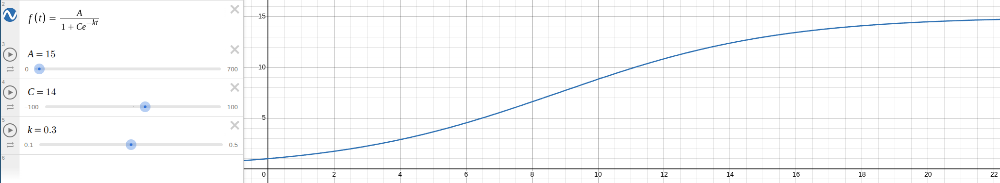

# Anxious Scroll Daemon

A custom userspace mouse scroll wheel daemon that intercepts and modifies scroll events from your physical mouse using the Linux evdev/uinput subsystem. Transform your mouse's scroll behavior with smooth, dynamic sensitivity that adapts to your scrolling speed.

## Overview

This project addresses the issue where the mouse firmware's "smart" scroll wheel behavior doesn't align with user preferences. Instead of modifying kernel drivers or system libraries, this daemon operates in userspace as a man-in-the-middle between your physical mouse and the input system.


## 🏗️ Architecture

```
Physical Mouse → evdev → Our Daemon → uinput → Virtual Mouse → libinput → Xorg → Applications
```

## 🧮 Scroll Transformation Algorithm

The basic idea is based on quake-live acceleration, where the faster you scroll, the faster the "acceleration" multiplier is. But instead of a bunch of ramp up and ramp down functions, I've used a smooth signmoid curve instead.



The daemon uses a logistic function for smooth, natural acceleration:

```
f(velocity) = max_sensitivity / (1 + C * e^(-ramp_rate * velocity))
```

Where:
- `base_sensitivity`: Starting sensitivity (default: 1.0)
- `max_sensitivity`: Maximum sensitivity (default: 15.0) 
- `ramp_rate`: How quickly to accelerate (default: 0.3)
- `C = (max_sensitivity / base_sensitivity) - 1`

This creates a smooth curve that starts slow for precision and ramps up for speed.

## 🚀 Quick Start

### Prerequisites

- Linux system with evdev/uinput support
- Rust toolchain (latest stable)
- Root privileges (for device access)

### Building

```bash
git clone <repository-url>
cd cursor-anxious
cargo build --release
```

### Running

```bash
# Auto-detect mouse device
sudo ./target/release/anxious-scroll-daemon

# Specify device manually
sudo ./target/release/anxious-scroll-daemon --device /dev/input/event3

# Enable debug logging
sudo ./target/release/anxious-scroll-daemon --debug
```

### Finding Your Mouse Device

```bash
# List all input devices
ls -l /dev/input/by-id/

# Test with evtest to see events
sudo evtest /dev/input/event3
```
